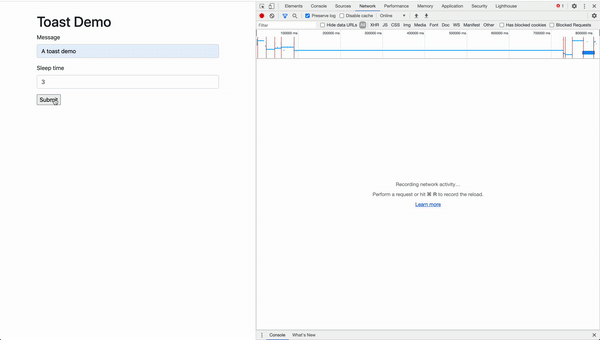

Title: Building realtime toasts with ASGI and Django
Date: 2020-08-24 8:00
Category: Python

This was my first attempt to build something using ASGI and Django. I compiled some of my asgi utils into a repo [dj-asgi-utils](https://github.com/massover/dj-asgi-utils).
It is not on pypi at the moment. If you want to skip to using the code, follow the [toasts section](https://github.com/massover/dj-asgi-utils#toasts) of the readme.
Hopefully it's easy to get up and running with real time toasts.

**Note** None of this code has been run in a production environment.



## The implementation

There are 4 parts:

1. A backend [SSE](https://developer.mozilla.org/en-US/docs/Web/API/Server-sent_events/Using_server-sent_events) stream of toasts.
2. A backend endpoint to acknowledge toasts.
3. A way to serve toast javascript and css in html responses.
4. A way to programmatically create toasts.


## A backend stream of toasts

Classes from [dj_asgi_utils.core](https://github.com/massover/dj-asgi-utils/tree/master/dj_asgi_utils/core) are used to build our
SSE event stream, including `AsyncStreamingHttpResponse`, `ASGIHandler`, and `sse`.

```python
import asyncio

from dj_asgi_utils.core import sse
from dj_asgi_utils.core.responses import AysncStreamingHttpResponse

async def toast_stream(user_id):
    while True:
        toasts = await async_toasts(user_id)
        serializer = ToastSerializer(toasts, many=True)
        yield sse(serializer.data, event="toast")
        await asyncio.sleep(10)


async def toast_stream_view(request):
    stream = toast_stream(1)
    response = AysncStreamingHttpResponse(
        streaming_content=stream, content_type="text/event-stream"
    )
    response["Cache-Control"] = "no-cache"
    return response
```

**Can you use the ORM?**

Yes you can with the [sync_to_async](https://docs.djangoproject.com/en/3.1/topics/async/#asgiref.sync.sync_to_async) 
wrapper. The example from the documentation seems rather straight forward.

```python
@sync_to_async
def get_blog(pk):
    return Blog.objects.select_related('author').get(pk=pk)
```

When I originally wrote the `async_toasts` function, the code looked roughly like:

```python
@sync_to_async
def async_toasts(user_id):
    return Toast.objects.filter(read=False, user_id=user_id).all()

async def some_async_view(user_id):
    toasts = await async_toasts(user_id)
    ...
```

If you called that view, you'd be greeted with a friendly `SynchronousOnlyOperation` exception. This exception is super helpful. It prevents
us from shooting ourselves in the foot. If you're an experienced Django developer you probably rely heavily on lazy querysets. When working with
the `sync_to_async` decorator, you need to evaluate your queryset before the coroutine returns. The example in the docs
works because `get` is not lazy, it returns results immediately. The end goal is to allow the ORM itself to be async
building upon an async driver but the support is not there yet.

```text
Exception inside application: You cannot call this from an async context - use a thread or sync_to_async.
Traceback (most recent call last):
  File "/lib/python3.7/site-packages/daphne/cli.py", line 30, in asgi
    await self.app(scope, receive, send)
  File "/lib/python3.7/site-packages/django/contrib/staticfiles/handlers.py", line 96, in __call__
    return await self.application(scope, receive, send)
  File "/dj_asgi_utils/core/handlers.py", line 48, in __call__
    (self.listen_for_disconnect, {"receive": receive}),
  File "/dj_asgi_utils/core/concurrency.py", line 9, in run_until_first_complete
    [task.result() for task in done]
  File "/dj_asgi_utils/core/concurrency.py", line 9, in <listcomp>
    [task.result() for task in done]
  File "/dj_asgi_utils/core/handlers.py", line 102, in send_response
    async for part in response:
  File "/dj_asgi_utils/core/responses.py", line 11, in <genexpr>
    self.make_bytes(chunk) async for chunk in streaming_content
  File "/dj_asgi_utils/toasts/streams.py", line 12, in toast_stream
    yield sse(serializer.data, event="toast")
  File "/lib/python3.7/site-packages/rest_framework/serializers.py", line 760, in data
    ret = super().data
  File "/lib/python3.7/site-packages/rest_framework/serializers.py", line 260, in data
    self._data = self.to_representation(self.instance)
  File "/lib/python3.7/site-packages/rest_framework/serializers.py", line 678, in to_representation
    self.child.to_representation(item) for item in iterable
  File "/lib/python3.7/site-packages/django/db/models/query.py", line 287, in __iter__
    self._fetch_all()
  File "/lib/python3.7/site-packages/django/db/models/query.py", line 1303, in _fetch_all
    self._result_cache = list(self._iterable_class(self))
  File "/lib/python3.7/site-packages/django/db/models/query.py", line 53, in __iter__
    results = compiler.execute_sql(chunked_fetch=self.chunked_fetch, chunk_size=self.chunk_size)
  File "/lib/python3.7/site-packages/django/db/models/sql/compiler.py", line 1152, in execute_sql
    cursor = self.connection.cursor()
  File "/lib/python3.7/site-packages/django/utils/asyncio.py", line 24, in inner
    raise SynchronousOnlyOperation(message)
django.core.exceptions.SynchronousOnlyOperation: You cannot call this from an async context - use a thread or sync_to_async.
```

## A backend endpoint to acknowledge toasts

APIs are way more fun to build with drf. We need a way for the user to acknolwedge the toast such that they dissapear
from the stream. A `/toast/:id/read/` action endpoint with permissions only for the owner will do.

```python
class ToastViewSet(GenericViewSet):
    queryset = Toast.objects.all()
    serializer_class = ToastSerializer
    permission_classes = [
        IsOwner,
    ]

    @action(detail=True, methods=["post"])
    def read(self, request, pk):
        toast = self.get_object()
        toast.read = True
        toast.save()
        serializer = self.get_serializer(toast)
        return Response(serializer.data)
```

## A way to serve toast javascript and css

The easiest way is a [middleware](https://github.com/massover/dj-asgi-utils/blob/master/dj_asgi_utils/toasts/middleware.py) that
injects the necessary javascript and css onto html responses, similar to `django-debug-toolbar.` Do not be like me; 
[read the docs](https://docs.djangoproject.com/en/3.1/topics/http/middleware/#asynchronous-support) about
asynchronous middleware. Removing all of the toast specific business logic, I started with a middleware 
(installed in my `MIDDLEWARE` setting) and view.

```python
def simple_middleware(get_response):
    def middleware(request):
        return get_response(request)

    return middleware

MIDDLEWARE = [
    ...,
    'path.to.simple_middleware',
]

async def toast_demo(request):
    form = ToastForm(request.POST or None)
    if request.method == "POST" and form.is_valid():

        async def sleep_task(user_id):
            message = f"Sleep running for at least {form.cleaned_data['sleep_time']} second(s)..."
            await async_create_toast(message, user_id)
            await asyncio.sleep(form.cleaned_data["sleep_time"])
            await async_create_toast(form.cleaned_data["message"], user_id)

        user_id = await get_user_id(request)
        loop = asyncio.get_event_loop()
        loop.create_task(sleep_task(user_id))
        return redirect("toast-demo")

    context = {"form": form}
    return render(request, "example/toast_demo.html", context=context)
```

The above code will hang forever, here, when awaiting from the first `async_create_toast` function. 

```text

> /usr/local/Cellar/python/3.7.5/Frameworks/Python.framework/Versions/3.7/lib/python3.7/threading.py(970)_bootstrap_inner()
    969             with _active_limbo_lock:
--> 970                 try:
    971                     # We don't call self._delete() because it also
```

While I don't understand exactly why the above is hanging, the [async middleware docs](https://docs.djangoproject.com/en/3.1/topics/http/middleware/#asynchronous-support)
provide the necessary decorators in order to create async middleware. In the case of async only, the middleware
can be:

```python
@async_only_middleware
def simple_middleware(get_response):
    async def middleware(request):
        return await get_response(request)

    return middleware
```

## Creating toasts

Toasts are created programmatically in either async or sync code. If you were in a pure async view, you'd use the async function. 
If you were testing using `./manage.py shell` to create some toasts, you'd use the sync function. Once toasts
are created, they would be available over the stream if the user is connected, until they are acknowledged.

```python
@sync_to_async
def async_create_toast(message, user_id):
    obj = Toast.objects.create(message=message, user_id=user_id)
    return obj


def create_toast(message, user_id):
    obj = Toast.objects.create(message=message, user_id=user_id)
    return obj
```

While some edges might still be rough around ASGI, it seems like a great foundation has been set up to both protect us 
and build upon. Have you started building anything with ASGI?